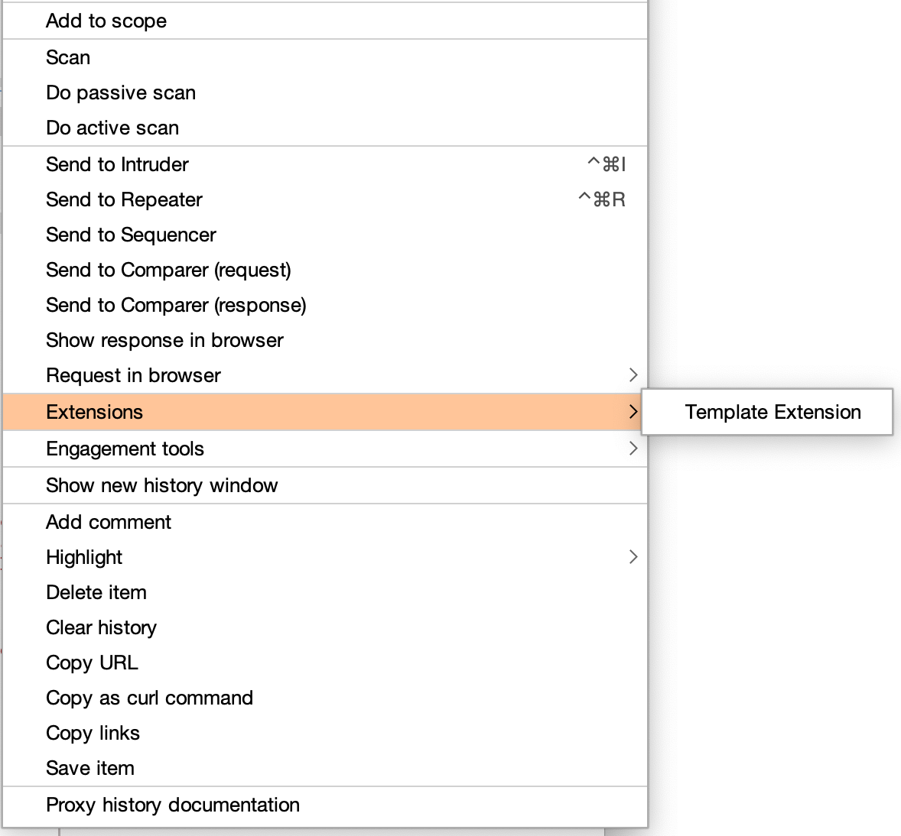
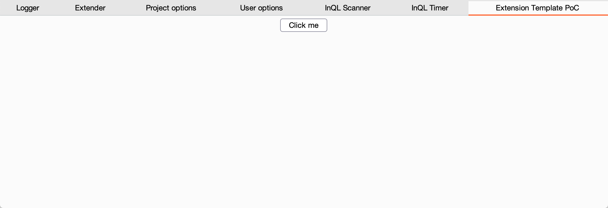

# Burp Suite Extension Template

## Installation
In Burp, go to the Extender tool, and the Extensions tab, and add a new extension. Select the extension type "Java", and specify the location of your JAR file.

## How to Build
### IntelliJ IDEA
If you are using intellij, you can build it with the following steps.

- 1. Open the Project Structure dialog: `File` -> `Project Structure`
- 2. Set target artifact: `Artifacts` -> `Add` -> `JAR` -> `From modules with dependencies...`
- 3. Close the Create JAR from Modules dialog: `OK`
- 4. Close the Project Structure dialog: `Apply` -> `OK`
- 5. Build JAR: `Build` -> `Build Artifacts` -> `Example:jar` -> `Build`.

### Command line

```
$ maven install
```

## Usage





## LICENSE

MIT License

Copyright (C) 2021 tkmru
